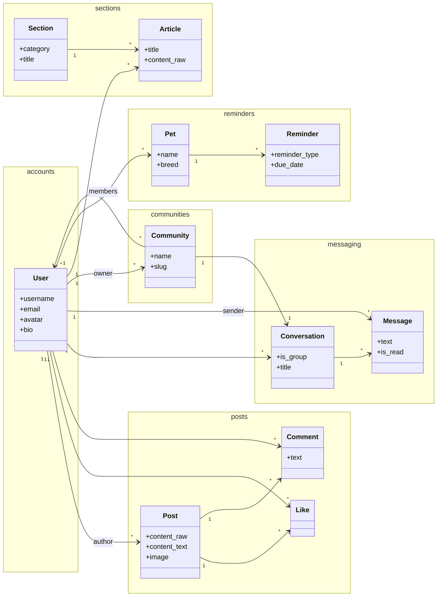
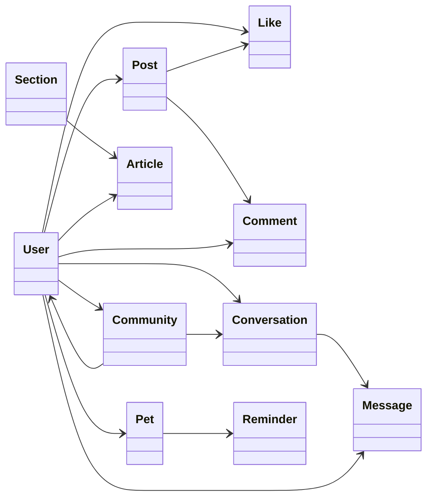

# Архитектура веб-сервиса «Кошкин Дом»

## Диаграмма классов (основные сущности)

Компактная группировка по доменам — элементы расположены ближе друг к другу.

### Альтернатива — одна плотная схема (все классы в ряд)

Если нужна ещё более компактная картинка без разделения на блоки:

